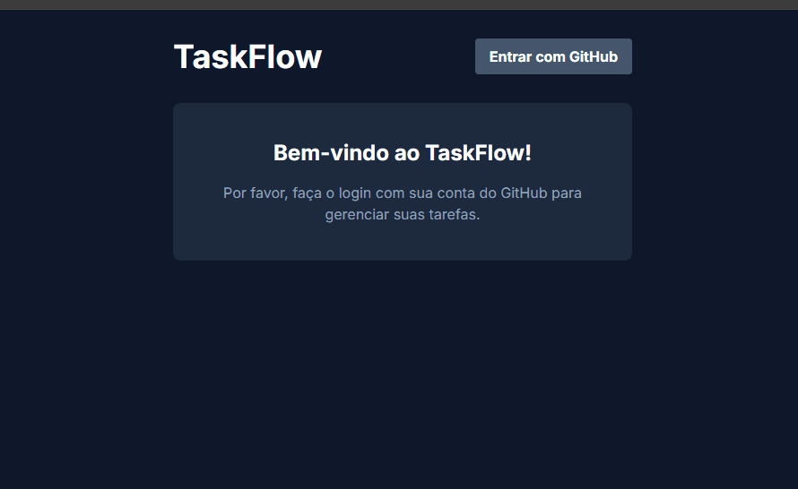

# TaskFlow ✨

A full-stack, multi-user task management application built with the T3 Stack principles in mind, using Next.js, NextAuth, Prisma, and Tailwind CSS.

**[➡️ Live Demo](https://your-live-url.com)** *(We will add this link in the next step!)*

 *(We will add this image soon)*

---

## ## ✨ Features

- **Full CRUD Functionality:** Create, Read, Update, and Delete tasks.
- **Secure Authentication:** User login via GitHub OAuth provided by NextAuth.js.
- **User-Specific Data:** Tasks are private to each logged-in user. The API is secured to prevent unauthorized access.
- **Professional UX:** Loading states for all asynchronous actions to provide clear user feedback.
- **Responsive Design:** A clean and modern UI that works on all screen sizes, built with Tailwind CSS.

---

## ## 🛠️ Tech Stack

- **Framework:** [Next.js](https://nextjs.org/) (App Router)
- **Authentication:** [NextAuth.js](https://next-auth.js.org/)
- **Database ORM:** [Prisma](https://www.prisma.io/)
- **Database:** SQLite
- **Styling:** [Tailwind CSS](https://tailwindcss.com/)
- **UI Components & Icons:** [Lucide React](https://lucide.dev/)
- **Language:** [TypeScript](https://www.typescriptlang.org/)

---

## ## 🚀 Getting Started

To run this project locally, follow these steps:

**1. Clone the repository**
```bash
git clone [https://github.com/your-username/taskflow.git](https://github.com/your-username/taskflow.git)
cd taskflow
```

**2. Install dependencies**
```bash
npm install
```

**3. Set up environment variables**
Create a `.env` file in the root of the project by copying the example file:
```bash
cp .env.example .env
```
Now, open the `.env` file and fill in the required variables:
- `GITHUB_ID`: Your GitHub OAuth App Client ID.
- `GITHUB_SECRET`: Your GitHub OAuth App Client Secret.
- `NEXTAUTH_SECRET`: A randomly generated secret key.

**4. Push the database schema**
```bash
npx prisma migrate dev
```

**5. Run the development server**
```bash
npm run dev
```
The application should now be running on [http://localhost:3000](http://localhost:3000).